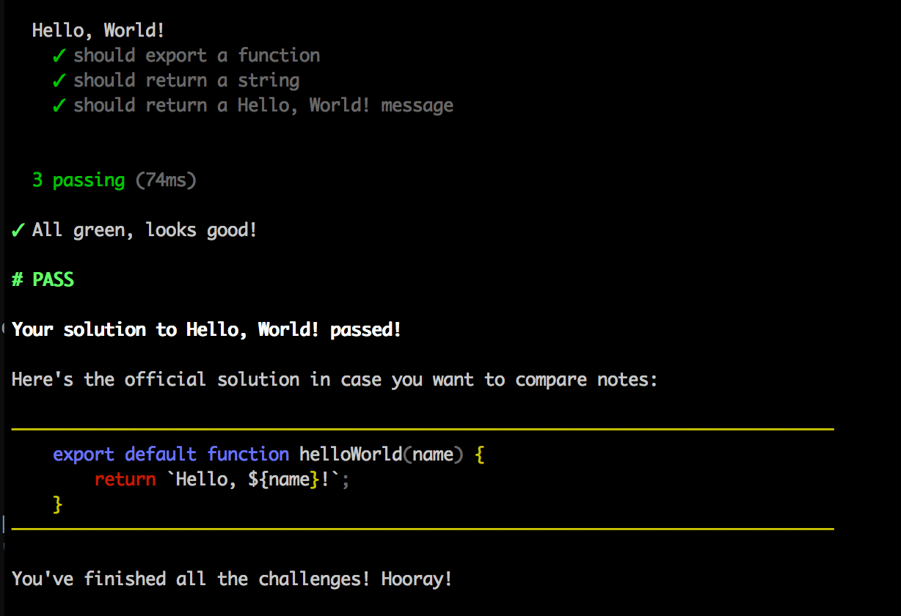

es6-workshop
==========

> A boilerplate for workshopper modules with Mocha tests and ES6 syntax

[](https://www.npmjs.com/package/es6-workshop) [](https://travis-ci.org/springload/es6-workshop) [](https://david-dm.org/springload/es6-workshop) [](https://david-dm.org/springload/es6-workshop)



1. Install [Node.js](http://nodejs.org/)
2. Run `npm install -g es6-workshop`
3. Run `es6-workshop`
4. **.. profit!**

## Contributing

Install the project with:

```sh
git clone git@github.com:springload/es6-workshop.git
cd es6-workshop
npm install
npm install -g eslint babel-eslint eslint-config-airbnb
./.githooks/deploy
```

To run the workshopper locally:

```sh
node src/index.js
```

To release a new version:

```sh
npm version minor -m "Release %s"
git push origin master
git push --tags
npm publish
```

To add a new exercise, you need to:

1. Add it to `src/exercises/menu.json`
2. Add the directory to `src/exercises/`, with a name matching the one in the menu
3. Add a `.spec.js` file in `src/tests`
4. Add test commands in `tests.sh`

To check your work, make sure to:

```sh
# Run your workshopper manually
node src/index.js
# Run linting and unit tests
npm run lint
npm run test
# Make sure your project compiles down to ES5
npm run build
# Setup your project on a CI platform like Travis, where it will run
npm run test:ci
```
